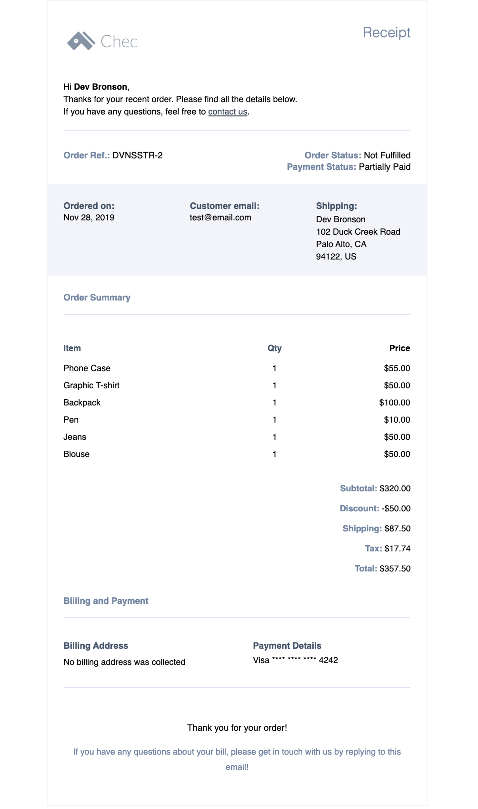

# Chec e-receipt email template with MJML 

This is a basic tutorial of creating your own custom e-receipt for your customers who have just made a purchase on your Chec e-Commerce website. Customized order receipts help to engage your customers, reassure that the purchase made on your website was indeed successful and also help to generate future purchases. We will be using MJML, an email templating framework to help with design and formatting. Be sure to give a read-over of [MJML docs](https://mjml.io/documentation/) to familiarize yourself a bit with MJML syntax. The best thing about MJML is the responsive templating, all tags and attributes are responsive, eliminating the hassle (because who really loves coding emails amiright) and thus giving time to actually code out your receipt data to your customers.  

We have made up this boilerplate template for you to start with. This bareboned template lays out all the necessary details your customer would look for in an e-receipt/invoice. So go head, clone this template and make it your own!



## What you will need to start this project

There are several different ways of installing and using MJML. For the sake of this tutorial and for a quick start, we chose to download MJML as a plugin in Visual Studio Code. Check out [MJML docs](https://mjml.io/documentation/#usage) for other usages.

* IDE Code Editor: VSCode, Atom, Sublime
* NPM or yarn
* MJML extension on code editor
* Basic knowledge of HTML syntax

## What this email template includes:

- Your custom company logo
- Customer reference number
- Order status
- Payment status
- Order date
- Customer email
- Shipping address
- Ordered items:
  - Product name
  - Quantity
  - Price
- Order Total 
- Billing address
- Payment details
- Thank you footer

## Lets start!

The first step is clone this repository locally. To do so follow these steps:

1. Open your Terminal window and type:

``` git clone https://github.com/chec/chec-receipt.git ```

2. Navigate into the repo:

``` cd chec-receipt ```

3. You now have a local copy of the merchant receipt template in your directory!

## Some things to note

Since you will be scaffolding this project and customizing it to fit the design of your e-receipt, we will go through a few explanations and things to note about the setup, structure and files on this project.

Be sure you have MJML installed otherwise you will not be able to use the built-in MJML tags and have them rendered into HTML. 

As you can see our project folder includes:

- `template.mjml` which is the native MJML file that we will be coding out our receipt content
- `template.html` is where the HTML code is transpiled with the MJML machine
- `data.json` is where our Chec receipt object data is being pulled from
- `index.html` is where we are including the `handlebars.js` CDN to parse our receipt object data in the mustache expressions into actual values

For this tutorial, we have pulled in data from a Chec demo store. Working with an actual receipt object, we can then use dot notations in the handlebars expression correctly to execute the property values onto our template.  

## Let's dive a bit deeper

We will deliberately be leaving out details on MJML syntax and instead focus on the overall concept of structuring out your receipt content and working with your receipt data. Depending on the email client you are using to send your receipts, some services allow you to directly fetch your receipt object from the client's API upon every successful successful payment. You could also alternatively send your receipts manually from the Chec dashboard. 


## Build your receipt template

MJML comes built in with its own CLI to easily build your template.

After you've made your changes and are ready to render the MJML template out into HTML, you can run the command below:

`mjml -r template.mjml -o template.html`

`template.mjml` is the input file and `template.html` is the output file where the rendered HTML goes.

With the generated HTML, you can now send your responsive receipt with your email client service or directly from your shell. 

## The finish line

And there you have it! See, we told you it was easy as pie, or did we not? Well now you know, how simple it is to create your own customized Chec e-receipt to send to your valued customers. 

Thank you for walking through the tutorial with us!


